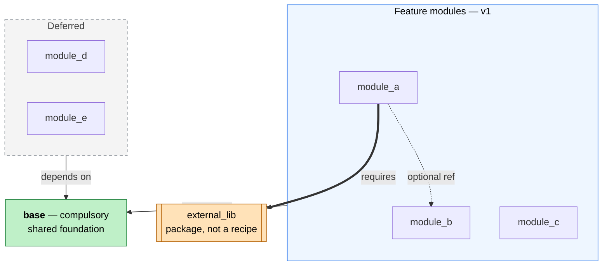

# Mermaid diagrams for Markdown

A diagram earns its place only when it is **faster to understand than the prose it
replaces**. A cluttered diagram is worse than no diagram: it costs the reader
effort and gives little back. So the goal is never "draw everything" — it is to
show _structure_ at a glance and let surrounding prose, tables, or code carry the
detail. Every principle below serves that one goal.

## Workflow

1. **Confirm a diagram is the right tool.** If the relationships are linear or
   trivial ("A then B then C"), a sentence or a list is clearer. Reach for a
   diagram when there is real structure: branching, grouping, many-to-one
   relationships, cycles, or layered dependencies.
2. **Pick the type** (table below) and read the matching reference file for syntax
   and idioms.
3. **Draft the structure**, then apply the design principles in order: kill the
   hairball, group, encode meaning, trim labels.
4. **Render-verify.** Mermaid syntax breaks easily. Confirm it parses (see
   _Render-verify_ below) before handing it over — a diagram that does not render
   is a hard failure, not a nitpick.
5. **Write the legend.** Pair every non-trivial diagram with a short "Reading the
   diagram" paragraph in prose. Color and shape mean nothing to the reader unless
   you say what they mean.

## Choosing the diagram type

| Need to show                                                         | Type               | Reference                                                      |
| -------------------------------------------------------------------- | ------------------ | -------------------------------------------------------------- |
| Components, dependencies, decisions, layered architecture            | flowchart / graph  | [references/flowchart.md](references/flowchart.md)             |
| Actors exchanging messages over time, API calls, protocols           | sequence           | [references/sequence.md](references/sequence.md)               |
| Data model: entities and relationships; OO classes; lifecycle states | ER / class / state | [references/data-models.md](references/data-models.md)         |
| System/container/context architecture at a defined zoom level        | C4 / architecture  | [references/architecture-c4.md](references/architecture-c4.md) |

When unsure between flowchart and a specialized type, prefer the specialized one:
a sequence diagram reads message flow far better than a flowchart of arrows, and
an ER diagram communicates cardinality that a generic graph cannot.

## Design principles

These are the difference between a diagram that clarifies and one that obscures.
They are ordered by impact.

### 1. Kill the hairball — deduplicate edges

The fastest way to wreck a graph is many identical edges crossing each other. When
several nodes share the **same** relationship to a common target (e.g. every
feature module depends on one base module), do not draw one arrow per node. Put the
nodes in a subgraph and draw **a single edge from the group** to the target, then
state the rule in the edge label. Ten crossing arrows become one, and the meaning
("all of these depend on base") is clearer, not less clear.

If edges genuinely differ (different relationship, different target), keep them
separate — that distinction is information. Dedupe only what is truly identical.

### 2. Group related nodes with subgraphs

Subgraphs turn a flat soup of boxes into a diagram with regions the eye can parse:
layers, bounded contexts, "ours vs theirs", "v1 vs deferred", trust boundaries.
Use `direction LR` (or `TB`) inside a subgraph to keep each group compact instead
of letting it stretch across the canvas.

### 3. Encode meaning with color — but never with color alone

Use `classDef` to give categories a consistent fill (status, ownership, layer).
Color is a powerful second channel, but ~8% of readers have color-vision
deficiency and many render diagrams in dark mode, so it must be **redundant**: pair
it with grouping, shape, or an explicit label so the diagram still reads in
grayscale. For contrast that survives both light and dark backgrounds, use
mid-tone fills with an explicit dark text color (`color:#000`) and a defined
stroke.

### 4. Shape carries meaning — respect convention

A reader decodes shape before they read text, so a misused shape actively
misleads. Keep shapes meaningful and conventional:

| Shape                   | Mermaid     | Means                                   |
| ----------------------- | ----------- | --------------------------------------- |
| Rectangle               | `["..."]`   | process, component, generic node        |
| Rounded / stadium       | `(["..."])` | start / end / terminal                  |
| Subroutine (double bar) | `[["..."]]` | module, library, package, sub-procedure |
| Cylinder                | `[("...")]` | datastore / database **only**           |
| Rhombus                 | `{"..."}`   | decision / branch                       |
| Hexagon                 | `{{"..."}}` | preparation / parameter                 |

The cylinder is the classic mistake: it reads as a database. Never use it for a
code module, a service, or a package — use the subroutine shape `[[...]]` for a
library/module instead.

### 5. Edge style carries meaning — and always legend it

Distinct relationship types deserve distinct edge styles, and the reader needs the
key:

- `-->` solid: the primary/default relationship (dependency, flow).
- `-.->` dotted: a secondary or weaker relationship (optional, config-level, cross-cutting).
- `==>` thick: a relationship of a different _kind_ (e.g. a different mechanism, an emphasized path).

Label edges with the relationship (`-->|"depends on"|`). If you use more than one
style, the prose legend must say what each means.

### 6. Trim labels — detail lives in the prose

Long labels bloat boxes and wrap unpredictably. Keep each node to a bold title and
at most one or two short qualifier lines (` `). The exhaustive field list, the
counts, the caveats belong in the surrounding text or a table, where they are
searchable and don't distort layout. A node is a landmark, not a paragraph.

### 7. Pick a direction that matches the meaning

`TB`/`TD` (top-down) for hierarchy, dependency, and decomposition — depth reads as
levels. `LR` (left-right) for pipelines, timelines, and process flow — progress
reads left to right. Don't fight the default layout with manual ordering; choose
the direction that makes the structure obvious.

### 8. Always ship a "Reading the diagram" legend

Immediately after the diagram, in prose, explain the encodings you used: what each
color means, what each shape means, what each edge style means, and any
group-edge convention ("one arrow per group = every member depends on the
target"). This is not optional decoration — without it the reader is reverse-
engineering your intent. Keep it to a few tight sentences.

## Render-verify

A diagram that does not parse is broken, and Mermaid is fussy. Before delivering:

- **Quote labels containing special characters.** Parentheses, `#`, `:`, `;`,
  `<`, `>`, quotes, and `&` inside an unquoted label break the parser. Wrap the
  label in double quotes: `node["text (with parens)"]`. Use ` ` for line
  breaks and `&amp;`/`&quot;`-style entities only inside quoted strings.
- **Subgraph edges need IDs.** To draw an edge from a group, give the subgraph an
  id: `subgraph grp["Label"]` then `grp --> target`.
- **`direction` inside subgraphs requires Mermaid ≥ 9.x.** GitHub and GitLab
  support it; if a local previewer is older the groups may render vertically. Note
  this if the target renderer is unknown.
- **Verify it actually renders**, don't just eyeball syntax. If a CLI is
  available, `mmdc -i file.mmd -o out.svg` (mermaid-cli) parses and fails loudly
  on errors. Otherwise check in the GitHub/GitLab preview or the Mermaid Live
  Editor (mermaid.live). State how you verified.

## Portability

GitHub and GitLab render Mermaid in Markdown natively, as do many wikis and VS
Code. Stay within standard, widely supported syntax; avoid relying on custom
themes, CSS, or bleeding-edge diagram types if the document must render across
tools. `classDef`/`class`, subgraphs, and the core shapes are universally safe.

## Worked example: from hairball to clear

The transformation that motivates this skill — nine identical edges converging on
one node, no grouping, a misused shape — fixed by applying the principles:

**Before** (cluttered): every feature node draws its own `--> base` edge; the
external module is a cylinder (reads as a DB); no grouping; long labels.

**After** (clear):

**Reading the diagram.** Green = the compulsory `base`; blue group = v1 modules;
grey dashed group = deferred; orange double-barred box = an external package (not a
module of this system). Each group draws one edge to `base` meaning _every member
depends on it_. Edges: solid = depends on, dotted = optional reference, thick =
hard requirement.

Six edges instead of a dozen, regions the eye can parse, shapes that mean what they
look like, and a legend so none of it has to be guessed.
